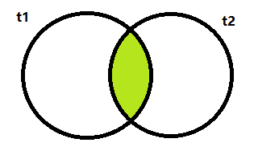
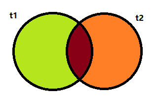
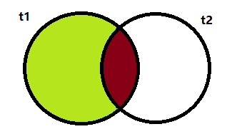
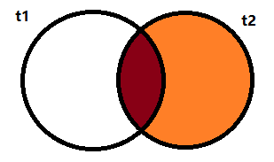
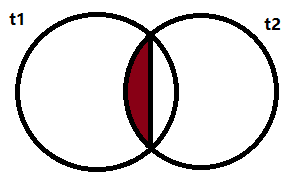
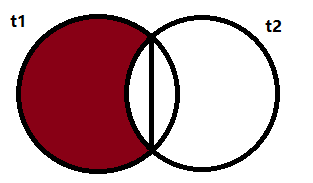
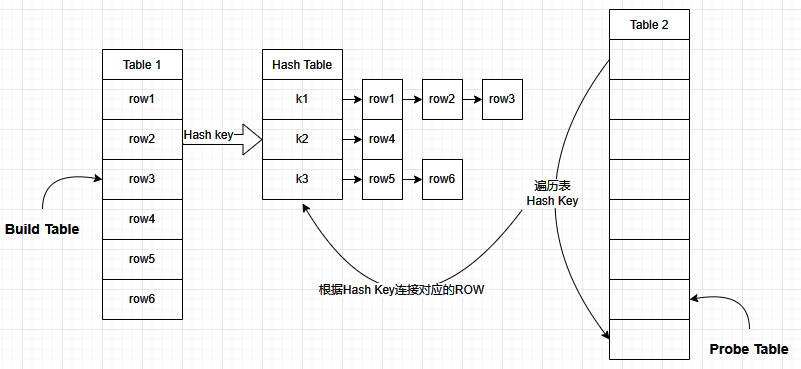
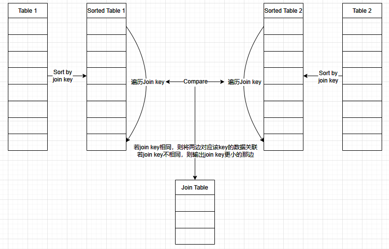
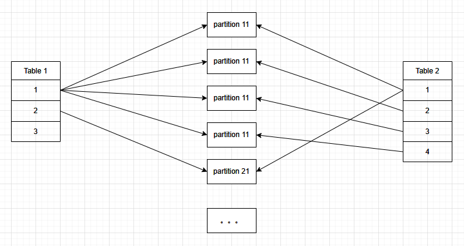
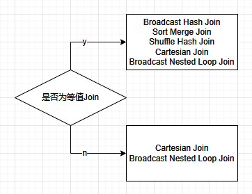

[TOC]

# 0 Spark Join

# 1 Spark Join Type

为了更直观的展示join后的数据，表t1、t2数据如下所示

**t1**

| id   | name |
| ---- | ---- |
|  0|张三|
|  1|李四|
|  2|王五|
|  3|赵六|
|  4|陈七|
|  5|郑八|

**t2**

可见，id为3的数据有重复，此处为有意为之。

| id|gender|
| ---- | ---- |
|  0|    男|
|  3|    男|
|  3|    女|
|  6|  未知|

## 1.1 [ INNER ] 内连接

默认的Join方式，取两表的交集。



```sql
select t1.*, t2.*
from t1
join t2
on t1.id = t2.id
```

| id|name| id|gender|
| ---- | ---- | ---- | ---- |
|  0|张三|  0|    男|
|  3|赵六|  3|    女|
|  3|赵六|  3|    男|

## 1.2 OUTER 外连接

外连接相对于内连接，取两表的并集或其中一表的全集。

### 1.2.1 FULL [ OUTER ] 全外连接



```sql
select t1.*, t2.*
from t1
full join t2
on t1.id = t2.id
```

| id|name| id|gender|
| ---- | ---- | ---- | ---- |
|   3|赵六|   3|    男|
|   3|赵六|   3|    女|
|   0|张三|   0|    男|
|   5|郑八|null|  null|
|null|null|   6|  未知|
|   1|李四|null|  null|
|   4|陈七|null|  null|
|   2|王五|null|  null|

### 1.2.2 LEFT [ OUTER ] 



```sql
select t1.*, t2.*
from t1
left join t2
on t1.id = t2.id
```

| id|name| id|gender|
| ---- | ---- | ---- | ---- |
|  0|张三|   0|    男|
|  1|李四|null|  null|
|  2|王五|null|  null|
|  3|赵六|   3|    女|
|  3|赵六|   3|    男|
|  4|陈七|null|  null|
|  5|郑八|null|  null|

### 1.2.3 RIGHT [ OUTER ]



```sql
select t1.*, t2.*
from t1
right join t2
on t1.id = t2.id
```

| id|name| id|gender|
| ---- | ---- | ---- | ---- |
|   0|张三|  0|    男|
|   3|赵六|  3|    男|
|   3|赵六|  3|    女|
|null|null|  6|  未知|

## 1.3 SEMI & ANTI

### 1.3.1 LEFT SEMI 半链接



```sql
select *
from t1
left semi join t2
on t1.id = t2.id
```

| id|name|
| ---- | ---- |
|  0|张三|
|  3|赵六|

显然，left semi join与其他的join有本质上的区别。右表t2只用于过滤左表的数据而不出现在结果集中，且右表中的匹配字段重复也并不会导致左边重复匹配。

在SQL层面其含义等同于如下：

```sql
SELECT *
FROM t1
WHERE t1.id IN (
    SELECT t2.id FROM t2
)
```

### 1.3.2 [ LEFT ] ANTI 反连接



功能与Semi相反。是从左表中排除右表连接键中的值。

```sql
select *
from t1
anti join t2
on t1.id = t2.id
```

| id|name|
| ---- | ---- |
|  1|李四|
|  2|王五|
|  4|陈七|
|  5|郑八|

在SQL层面其含义等同于如下：

```sql
SELECT *
FROM t1
WHERE t1.id NOT IN (
    SELECT t2.id FROM t2
)
```

### 1.3.3 总结

1. SEMI & ANTI都只取左表数据，右表只取关联键来过滤左表，因此右表的重复不会影响左表。
2. 不存在RIGHT SEMI或RIGHT ANTI。
3. 在2.4.6版本中。SEMI 必须写成left semi，而anti则可以省略left。而在3.x的版本中SEMI 也可省略left。

## 1.4 CROSS 交叉链接

CROSS JOIN会返回两张表的笛卡尔积，即将左表的每一条数据都与右表中的每一条数据进行链接。因此CROSS JOIN无需指定连接键。

```sql
select t1.*, t2.*
from t1
left join t2
on t1.id = t2.id
```

| id|name| id|gender|
| ---- | ---- | ---- | ---- |
|  0|张三|  0|    男|
|  0|张三|  3|    男|
|  0|张三|  3|    女|
|  0|张三|  6|  未知|
|  1|李四|  0|    男|
|  1|李四|  3|    男|
|  1|李四|  3|    女|
|  1|李四|  6|  未知|
|  2|王五|  0|    男|
|  2|王五|  3|    男|
|  2|王五|  3|    女|
|  2|王五|  6|  未知|
|  3|赵六|  0|    男|
|  3|赵六|  3|    男|
|  3|赵六|  3|    女|
|  3|赵六|  6|  未知|
|  4|陈七|  0|    男|
|  4|陈七|  3|    男|
|  4|陈七|  3|    女|
|  4|陈七|  6|  未知|

> Cross join会使数据量倍增，需要谨慎使用。

# 2 Join算法

## 2.1 Nested-Loop Join

最基本的Nested-Loop 算法，其实就是暴力求解，通过穷举每一个可能来判断是否满足条件，如果满足就输出这个元组。

Nested Loop join 的执行看做下面的计算：

```python
for record_1 in relation_1:
  for record_2 in relation_2:
    # join condition...
```

## 2.2 Hash Join（大+小）



**Hash Join的过程**

1. 确定Build Table和Probe Table。一般将较小的表作为Build Table。
2. 遍历Build Table，Hash Join Key，生成Hash Table。Hash Table一般会存储在内存中，若内存中存不下，则dump到磁盘。
3. 遍历Probe Table，Hash Join Key，通过hash后的join key获取要链接的行。

> 显然，Hash Join适用于**大表与小表**之间的Join。若Build Table的大小过大，导致Hash Table无法完整的存储在内存中，join效率就会大打折扣。

> Hash Join的时间复杂度仅为O(a+b)，相较于最极端的笛卡尔积（时间复杂度O(ab)）提升巨大。

## 2.3 Sort Merge Join（大+大）



**Sort Merge Join的过程**

1. 将两表各根据 Join Key 排序。
2. 遍历并比较两个表的 Join Key 序列，若join key相同，则将两边对应该key的数据关联；若join key不相同，则输出join key更小的那边。

> 显然，Sort Merge Join并不在乎两表间的大小相差是大或小，因此常用于**两张大表**直接的Join操作。

> 无论Hash Join还是Sort Merge Join，都仅支持等值链接。非等值Join将会采用笛卡尔积形式Join，此时的时间复杂度将达到最高的O(ab)，因此应尽量使用等值join。

> Sort Merge Join需要Join Key支持排序。而Hash Join则不需要。

# 3 Spark Join Strategy

Spark提供了5种JOIN机制来执行具体的JOIN操作。分别为：

- Shuffle Hash Join
- Broadcast Hash Join
- Sort Merge Join
- Cartesian Join
- Broadcast Nested Loop Join

其中，Broadcast Hash Join 和 Shuffle Hash Join 都是对于Hash Join的分布式实现。Cartesian Join 和 Broadcast Nested Loop Join 的时间复杂度都是O(ab)，当使用这两种策略时，Join速度会极慢，故应当尽量避免。

## 3.1 Broadcast Hash Join

Broadcast Hash Join也被叫做Map端JOIN。当有一张表较小，可以采用该策略提高Join性能。在进行 Broadcast Join 之前，Spark 需要把处于 Executor 端的数据先发送到 Driver 端，然后 Driver 端再把数据广播到 Executor 端。

**注意：**

1. 被广播的表应小于**spark.sql.autoBroadcastJoinThreshold**所配置的大小（默认为10M，设置为-1则表示禁用广播）。被广播表的大小阈值不能超过8GB。
2. 基表不可以被广播。如left join时，只能广播右表。

**缺点：**

1. 只适用于较小的表，否则数据的冗余传输会远大于Shuffle的开销。
2. 被广播的表要collect到Driver端。要广播的表多的情况下，对Driver的内存也是一个考验。

## 3.2 Sort Merge Join

Sort Merge Join先将两张大表根据Join key进行Shuffle重分区。然后在每个分区内进行单机版的Sort Merge Join。

该JOIN机制是Spark默认的，可以通过参数**spark.sql.join.preferSortMergeJoin**进行配置，默认是true，即优先使用Sort Merge Join。

- 仅支持等值连接
- 支持所有join类型
- Join Keys是排序的

## 3.3 Shuffle Hash Join

Shuffle Hash Join先将两张表根据 Join Key 进行Shuffle，因此，相同Join Key值的数据将会被分到一个分区。在各自分区内Hash Join，便成了小份与小份间的Join。

## 3.4 Cartesian Join

Cartesian Join即笛卡尔积，也叫做Shuffle-and-replicate Nested Loop Join。如果 Spark 中两张参与 Join 的表没指定join key（ON 条件）那么会产生 Cartesian product join，这个 Join 得到的结果其实就是两张行数的乘积。



输出分区的数量始终等于输入数据集分区数量的乘积。在每个分区内，收到的两份数据进行笛卡尔乘积。

**注意：**

- 仅支持内连接
- 支持等值和不等值连接
- 开启参数spark.sql.crossJoin.enabled=true。在Spark 3.x版本中，该默认值改为true。

## 3.5 Broadcast Nested Loop Join

Broadcast nested loop join 支持等值和不等值 Join，支持所有的 Join 类型。是在没有合适的JOIN机制可供选择时，最终会选择的策略。

其中，不同类型的Join会有不同的具体实现，具体实现方式参考org.apache.spark.sql.execution.joins.BroadcastNestedLoopJoinExec

# 4 Join Hint

> Spark官网解释及使用样例：[Hints - Spark 3.3.2 Documentation (apache.org)](https://spark.apache.org/docs/3.3.2/sql-ref-syntax-qry-select-hints.html#join-hints-types)

Join hints 可以让用户建议 Spark 采用某种 Join 策略。

**注意：**

在 **Spark 3.0 版本**之前，其仅支持 `BROADCAST` 。`MERGE`, `SHUFFLE_HASH` 和 `SHUFFLE_REPLICATE_NL` 则是在 Spark 3.0 版本才加入。

示例：

```sql
SELECT /*+ BROADCAST(t1) */ * FROM t1 INNER JOIN t2 ON t1.key = t2.key;
SELECT /*+ BROADCAST(t1), MERGE(t1, t2) */ * FROM t1 INNER JOIN t2 ON t1.key = t2.key;
```

## 4.1 BROADCAST

建议Spark使用**broadcast join**。Hint指定的表会被广播，并且会忽略 `autoBroadcastJoinThreshold` 设置的广播最大表大小。如果Join的两侧都设置了该Hint，则广播较小的一边。

`BROADCASTJOIN` 、`MAPJOIN` 同 `BROADCAST` 。

## 4.2 SHUFFLE_HASH

建议Spark使用**shuffle hash join**。如果Join的两侧都设置了该Hint，则较小的一边作为build table。

## 4.3 MERGE

建议Spark使用**shuffle sort merge join**。

`MERGE` 别名 `SHUFFLE_MERGE` and `MERGEJOIN`.

## 4.4 SHUFFLE_REPLICATE_NL

建议Spark使用**shuffle-and-replicate nested loop join**，即笛卡尔积 Cartesian Product Join。

# 5 Join Selection

Join策略选择的具体实现参考org.apache.spark.sql.execution.SparkStrategies.JoinSelection的apply方法。

1. 需要判断 Join 条件是否为等值链接。
2. 检查是否使用了hint指定Join方式。
3. 若用户指定了Hint，则根据用户指定的Hint采取Join策略
4. 若用户未指定了Hint，则根据规则逐步选择Join策略。优先级为：*Broadcast Hash Join > Sort Merge Join > Shuffle Hash Join > cartesian Join > Broadcast Nested Loop Join*。

## 5.1 判断Join条件



## 5.2 指定 Hint

### 5.2.1 等值连接

**依次**检查如下的Hint。

| Hint                 | 检查条件         | Join                    |
| -------------------- | ---------------- | ----------------------- |
| BROADCAST            | join类型支持     | Broadcast Hash Join     |
| MERGE                | join key是排序的 | Shuffle Sort Merge Join |
| SHUFFLE_HASH         | join类型支持     | Shuffle Hash Join       |
| SHUFFLE_REPLICATE_NL | 是内连接         | Cartesian Product Join  |

### 5.2.2 非等值连接

**依次**检查如下的Hint。

| Hint                 | 检查条件 | Join                       |
| -------------------- | -------- | -------------------------- |
| BROADCAST            | 无       | Broadcast Nested Loop Join |
| SHUFFLE_REPLICATE_NL | 是内连接 | Cartesian Product Join     |

## 5.3 未指定 Hint

### 5.3.1 等值连接

**依次**检查。

| 检查条件                                                     | Join                       |
| ------------------------------------------------------------ | -------------------------- |
| join类型支持，并且其中一张表能够被广播（见3.1）              | Broadcast Hash Join        |
| join keys 是排序。<br />并且**spark.sql.join.preferSortMergeJoin**设定为true（默认为true）。 | Shuffle Sort Merge Join    |
| **spark.sql.join.preferSortMergeJoin**设定为false。          | Shuffle Hash Join          |
| 是内连接。                                                   | Cartesian Product Join     |
| 可能会发生OOM。或者没有可以选择的执行策略。                  | Broadcast Nested Loop Join |

### 5.3.2 非等值连接

**依次**检查。

| 检查条件                                    | Join                       |
| ------------------------------------------- | -------------------------- |
| 其中一张表足够小（可以被广播）。            | Broadcast Nested Loop Join |
| 是内连接。                                  | Cartesian Product Join     |
| 可能会发生OOM。或者没有可以选择的执行策略。 | Broadcast Nested Loop Join |

# 6 Join优化案例

由于非等值Join需要将两表数据完全一对一检查，因此计算性能极差。在使用Join时，应尽量避免采用非等值Join。比如最基本的以添加区间值列来代替大于小于；用not exists或anti join代替not in等。

## 6.1 多个等值条件 但是 或者关系

假设我们有两张表。person、course数据如下所示。可见，course表中学生的id，姓名字段有所缺失。因此在关联时需要使用 id相等 **或** name相等 作为关联条件。

**person**

| id   | name |
| ---- | ---- |
| 0    | 张三 |
| 1    | 李四 |
| 2    | 王五 |
| 3    | 赵六 |
| 4    | 陈七 |
| 5    | 郑八 |

**course**

| id   | name | course_id |
| ---- | ---- | --------- |
| 0    |      | 1         |
|      | 张三 | 3         |
| 1    | 李四 | 2         |
| 3    |      | 4         |
| 4    | 陈七 | 5         |
|      | 陈七 | 7         |
| 5    | 郑八 | 7         |

此时我们获取一下其执行策略。

```sql
SELECT *
FROM person
    LEFT JOIN course
    ON person.id = course.id
        OR person.name = course.name
```

```
== Physical Plan ==
BroadcastNestedLoopJoin BuildRight, LeftOuter, ((id#10 = id#24) || (name#11 = name#25))
:- *(1) FileScan csv [id#10,name#11] Batched: false, Format: CSV, Location: InMemoryFileIndex[file:/E:/spark-sql/input/person/person.csv], PartitionFilters: [], PushedFilters: [], ReadSchema: struct<id:string,name:string>
+- BroadcastExchange IdentityBroadcastMode
   +- *(2) FileScan csv [id#24,name#25,course_id#26] Batched: false, Format: CSV, Location: InMemoryFileIndex[file:/E:/spark-sql/input/person/course.csv], PartitionFilters: [], PushedFilters: [], ReadSchema: struct<id:string,name:string,course_id:string>
```

可见，此处的Join策略选择了BroadcastNestedLoopJoin。原因是，虽然join的两个条件单独来看都是等值，但其中间是或运算。这就导致这个join条件的整体成为了一个非等值运算，因此无法使用Hash Join或者Sort Merge Join。当遇到这种需求时，可以用以下方式来替换。

```sql
WITH id_join AS (
    SELECT person.id AS pid, course.*
    FROM person
        JOIN course
            ON person.id = course.id
), name_join AS (
    SELECT person.id AS pid, course.*
    FROM person
        JOIN course
            ON person.name = course.name
), union_subjoin AS (
    SELECT * FROM id_join
    UNION
    SELECT * FROM name_join
)
SELECT *
FROM person
    LEFT JOIN union_subjoin
        ON person.id = union_subjoin.pid
```

```
== Physical Plan ==
*(8) Sort [pid#57 ASC NULLS FIRST], true, 0
+- Exchange rangepartitioning(pid#57 ASC NULLS FIRST, 200)
   +- *(7) BroadcastHashJoin [id#10], [pid#57], LeftOuter, BuildRight
      :- *(7) FileScan csv [id#10,name#11] Batched: false, Format: CSV, Location: InMemoryFileIndex[file:/E:/spark-sql/input/person/person.csv], PartitionFilters: [], PushedFilters: [], ReadSchema: struct<id:string,name:string>
      +- BroadcastExchange HashedRelationBroadcastMode(List(input[0, string, true]))
         +- *(6) HashAggregate(keys=[pid#57, id#24, name#25, course_id#26], functions=[])
            +- Exchange hashpartitioning(pid#57, id#24, name#25, course_id#26, 200)
               +- *(5) HashAggregate(keys=[pid#57, id#24, name#25, course_id#26], functions=[])
                  +- Union
                     :- *(2) Project [id#10 AS pid#57, id#24, name#25, course_id#26]
                     :  +- *(2) BroadcastHashJoin [id#10], [id#24], Inner, BuildLeft
                     :     :- BroadcastExchange HashedRelationBroadcastMode(List(input[0, string, true]))
                     :     :  +- *(1) Project [id#10]
                     :     :     +- *(1) Filter isnotnull(id#10)
                     :     :        +- *(1) FileScan csv [id#10] Batched: false, Format: CSV, Location: InMemoryFileIndex[file:/E:/spark-sql/input/person/person.csv], PartitionFilters: [], PushedFilters: [IsNotNull(id)], ReadSchema: struct<id:string>
                     :     +- *(2) Project [id#24, name#25, course_id#26]
                     :        +- *(2) Filter isnotnull(id#24)
                     :           +- *(2) FileScan csv [id#24,name#25,course_id#26] Batched: false, Format: CSV, Location: InMemoryFileIndex[file:/E:/spark-sql/input/person/course.csv], PartitionFilters: [], PushedFilters: [IsNotNull(id)], ReadSchema: struct<id:string,name:string,course_id:string>
                     +- *(4) Project [id#10 AS pid#58, id#24, name#25, course_id#26]
                        +- *(4) BroadcastHashJoin [name#11], [name#25], Inner, BuildLeft
                           :- BroadcastExchange HashedRelationBroadcastMode(List(input[1, string, true]))
                           :  +- *(3) Project [id#10, name#11]
                           :     +- *(3) Filter (isnotnull(name#11) && isnotnull(id#10))
                           :        +- *(3) FileScan csv [id#10,name#11] Batched: false, Format: CSV, Location: InMemoryFileIndex[file:/E:/spark-sql/input/person/person.csv], PartitionFilters: [], PushedFilters: [IsNotNull(name), IsNotNull(id)], ReadSchema: struct<id:string,name:string>
                           +- *(4) Project [id#24, name#25, course_id#26]
                              +- *(4) Filter isnotnull(name#25)
                                 +- *(4) FileScan csv [id#24,name#25,course_id#26] Batched: false, Format: CSV, Location: InMemoryFileIndex[file:/E:/spark-sql/input/person/course.csv], PartitionFilters: [], PushedFilters: [IsNotNull(name)], ReadSchema: struct<id:string,name:string,course_id:string>
```

可见，修改后的Join方式全部为3次BroadcastHashJoin，以及几次排序。而BroadcastHashJoin的时间复杂度仅为O(a+b)，而BroadcastNestedLoopJoin复杂度为O(ab)。因此，假设替换后的Join数目为x，当数据量够大，即a,b >> x时，ab >> x(a+b)。也就是说，即使多次BroadcastHashJoin，性能依旧远远好于BroadcastNestedLoopJoin。

