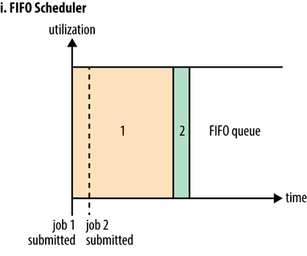
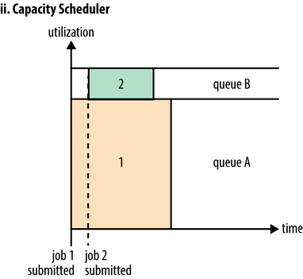
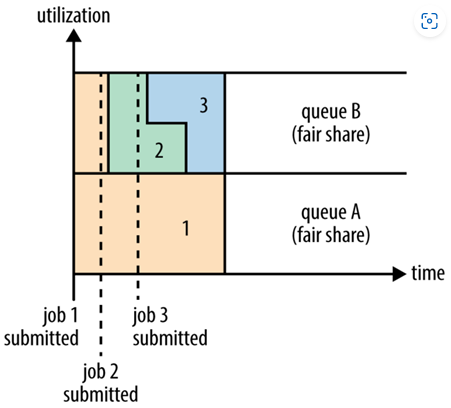

# 0 Yarn调度器

在Yarn中有三种调度器可以选择

- FIFO Scheduler（先进先出调度器）
- Capacity Scheduler（容量调度器）
- Fair Scheduler（公平调度器）

其中，Apache版本的Hadoop，其默认调度器即为容量调度器；而CDH版本的Hadoop，其默认调度器则为公平调度器。

# 1 FIFO Scheduler

FIFO [Scheduler](https://so.csdn.net/so/search?q=Scheduler&spm=1001.2101.3001.7020)（先进先出调度器），这种调度器其实已经耳熟能详了，它将所有任务放入一个队列，先进队列的先获得资源，排在后面的任务只有等待，总的原则就是先到先得。

# 2 Capacity Scheduler

Capacity Scheduler（容量调度器）的核心思想是：提前做预算，在预算指导下分享集群资源。Apch Yarn默认的调度策略。

划分多个队列，用于提交不同的任务，并对这些队列提前预分配资源，可以按照百分比来分配，也可以按照容量来分配。但单个队列内还是采用先用先出的调度算法。

但假设很长一段时间，都没有大任务提交到A队列中，B队列却很繁忙，A队列占用的80%的资源一直处于空闲状态，造成了集群资源的浪费。

那能够让B队列使用空闲的资源吗？是可以的。可以动态调整队列容量，设置队列最大资源占用，现在的配置情况是A为80%，B为20%，但可以配置队列B最大可以占用集群90%的资源，于是队列B在集群空闲的时候，就可以拿到90%的运算资源，减少集群资源浪费。

当然也可以设置为100%，但这样的话，如果队列A此时提交任务，容量调度支持抢占，需要队列B释放资源，这部分的调度过程是有开销的。

如果存在多个队列，集群出现的空闲资源如何分配？会弹性分配，优先分配给“实际资源/预算资源”比值最低的队列。

而且容量调度可以嵌套子队列，作业分配时更加灵活。队列A提交大任务，队列B提交紧急任务和小任务，队列B又可以划分队列C、D，队列C专门用于紧急任务，队列D用于小任务。

容量调度方式在企业中比较常用，它预分队列的方式可以为不同部门、不同运算任务限定不同的资源，而且因为其动态和弹性的特征，有效解决了很多的问题。

# 3 Fair Scheduler

Fair Scheduler（公平调度器），也是进行多队列的划分，但不会为每个队列预先分配资源，而是多队列公平共享集群资源。

现在有队列A和队列B，它们不预分配队列资源，于是队列A在开始的时候将任务1提交到集群中，此时发现集群并没有任务在运行，于是就占用了集群的全部资源。但过了一段时间，队列B中提交了任务2，发现集群没有资源了，于是队列B可以抢占资源，抢占多少呢？公平起见，当然是见面分一半，给队列A一点调度时间，将一半资源分配给队列B，于是队列B中开始运行任务2。

公平调度，允许队列之间抢占，当然队列内部也可配置调度策略为FIFO或者Fair（默认）。按照默认情况，队列B中任务2执行了一段时间之后，任务3被提交上来了，怎么办？见面分一半，给任务2一点时间进行调度，将一半资源分配给任务3运行。

队列内部的这种分一半的策略不是无限进行的，每个队列会设置队列内同时运行的最大任务数来避免这种拆分方式导致任务获得的资源不足的情况。

当然这不是绝对的公平，因为见面分一半是好的，但有一些队列因为提交的任务特殊，所以需要更多的资源。此时可以调节队列权重，当集群存在空闲资源的时候，按照权重来分配资源，队列在默认情况下，初始权重均为1。

> 实际上，容量调度器即为调度策略设置为FIFO的公平调度器。