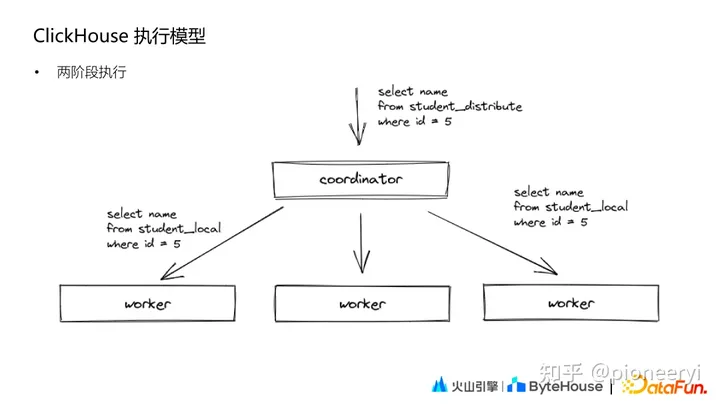

> 大家都知道ClickHouse单表查询性能很卓越，而JOIN查询则性能不佳。然而有没有想过为什么CK的JOIN性能不佳，差在哪里了？以及如果非用不可，那么怎么优化CK的Join了？本文对查到的一些资料进行了总结，在此对相关作者表示感谢，所参考的文档见文末参考文档那一栏。

ClickHouse系列文章：

1. [ClickHouse如何更新数据](https://zhuanlan.zhihu.com/p/485645089)
2. [ClickHouse Join为什么被大家诟病？](https://zhuanlan.zhihu.com/p/587765205)
3. [有必要了解下ClickHouse的索引原理](https://zhuanlan.zhihu.com/p/588458902)

## 一、基础知识

首先我们先了解下，在单机模式和分布式模式下，常见的Join方式有哪些。

### 单机Join

一般的Join算法：Nested-Loop Join (NL Join)、Block Nested-Loop Join、Sort Merge Join、Hash Join。

**Nested-Loop Join**

算法原理如下：

```text
# Nested-Loop Join
for outer_row in outer_table:
   for inner_row in inner_table:
      if join_condition is True:
         output (outer_row, inner_row)

# Index Nested-Loop Join
for outer_row in outer_table:
   for inner_row in inner_index.lookup(outer_join_key):
      if join_condition is True:
         output (outer_row, inner_row)
```

对于Nested Loop算法，最关键的点在于它的执行效率。假如参与Join的两张表一张量级为1万，一张量级为10w，那么进行比较的次数为1w*10w=10亿次。在大数据时代，通常一张表数据量都是以亿为单位，如果使用Nested Loop Join算法，那么Join操作的比较次数直接就是天文数字了。所以Nested Loop Join基本上是作为万不得已的保底方案。Nested Loop这个框架下，常见的优化措施如下：

- 小表驱动大表，即数据量较大的集作为于for循环的内部循环。
- 一次处理一个数据块，而不是一条记录。也就是所谓的Block Nested Loop Join，通过分块降低IO次数，提升缓存命中率。

**Block Nested-Loop Join**

将外层循环的行/结果集存入join buffer, 内层循环的每一行与整个buffer中的记录做比较，从而减少内层循环的次数. 举例来说，外层循环的结果集是100行，使用NLJ 算法需要扫描内部表100次，如果使用BNL算法，先把对Outer Loop表(外部表)每次读取的10行记录放到join buffer,然后在InnerLoop表(内部表)中直接匹配这10行数据，内存循环就可以一次与这10行进行比较, 这样只需要比较10次，对内部表的扫描减少了9/10。所以BNL算法就能够显著减少内层循环表扫描的次数. 前面描述的query, 如果使用join buffer。

**Sort Merge Join**

通过前面的分析可以知道，Nested Loop Join算法的关键问题在于比较次数过多，算法的复杂度为O(m*n)，那么突破口也得朝着这个点。如果集合中的元素是有序的，比较的次数会大幅度降低，避免很多无意义的比较运算。

通过将JOIN操作拆分成Sort和Merge两个阶段实现Join操作的加速。对于Sort阶段，是可以提前准备好可以复用的。这样的思想对于MySQL这类关系型数据库是非常友好的，这也能解释阿里巴巴开发手册中要求关联的字段必须建立索引，因为索引保证了数据有序。该算法时间复杂度为排序开销O(m*log(m)+n*log(n))+合并开销O(m+n)。但是通常由于索引保证了数据有序，索引其时间复杂度为O(m+n)。

**Hash Join**

Hash join的实现分为build table也就是被用来建立hash map的小表和probe table，首先依次读取小表的数据，对于每一行数据根据连接条件生成一个hash map中的一个元組，数据缓存在内存中，如果内存放不下需要dump到外存。依次扫描探测表拿到每一行数据根据join condition生成hash key映射hash map中对应的元組。

### 分布式Join


如上图所示，分布式 Join主要有四种：

- A **shuffle join** re-distributes rows from both tables among nodes based on join key values, such that all rows with the same join key value are moved to the same node. Depending on a particular algorithm used to compute joins, a shuffle join can be a shuffle hash join, shuffle sort-merge join, and so forth.
- A **broadcast join** moves data stored in only one table, such that all rows from the smallest table are available on every node. Depending on a particular algorithm used to compute joins, a broadcast join can be a broadcast hash join, broadcast nested-loop join, and so forth.
- A **co-located join** does not need to move data at all because data is already stored such that all rows with the same join key value reside on the same node. Data still needs to be joined using a nested-loop, sort-merge, or hash join algorithm.
- A **pre-computed join** does not need to move data or compute joins locally on each node because data is already stored in a joined form. This type of join skips data movement and join computation and goes directly to merging and returning results.

## 二、其他MPP引擎实现

目前主流的MPP数据库基本都支持Stage执行的方式。以Presto为例，如下图所示，一个两表join的agg sql可拆分为5个 Stage。


其中 Stage3、Stage4分别对应左右表数据读取，Stage2完成两表Join和partial agg 计算，Stage1完成final agg计算，Stage0收集Stage1的数据后汇总和输出。在这个过程中，Stage 3、4、2、1可以在多个节点上并行执行，单个复杂的query被拆分成若干Stage，从而实现了Stage之间，不同worker的数据传输。

## 三、ClickHouse Join

ClickHouse Join分为单机Join 和分布式Join。

### 3.1、单机Join

SQL 里面只有本地表的 JOIN，只会在当前节点执行。本地JOIN方式分为Hash JOIN和Merge Join。优先使用 hash join 当内存达到一定阈值后再使用 merge join，优先满足性能要求。

**Hash Join**

- 右表全部数据加载到内存，再在内存构建 hash table。key 为 joinkey。
- 从左表分批读取数据，从右表 hash table匹配数据。

**Merge join**

- 对右表排序，内部 block 切分，超出内存部分 flush 到磁盘上，内存大小通过参数设定。
- 左表基于 block 排序，按照每个 block 依次与右表 merge。

### 3.2、分布式Join

分布式Join分为普通分布式Join以及Global Join。在分析两种Join的执行流程下，我们先看看CK的执行模式。

**执行模式**

ClickHouse 的执行模式相对比较简单，和Druid、ES 类似，其基本查询模式分为两个阶段：



第一阶段，Coordinator 收到查询后将请求发送给对应的 worker 节点；第二阶段，Coordinator 收到各个 worker 节点的结果后汇聚起来处理后返回。

**普通分布式Join**

```sql
SELECT 
    et.os_name, 
    ut.device_id AS user_device_id
FROM tob_apps_all AS et 
ANY LEFT JOIN 
(
    SELECT 
        device_id, 
        hash_uid
    FROM users_unique_all 
    WHERE (tea_app_id = 268411) AND (last_active_date >= '2022-08-06')
) AS ut ON et.hash_uid = ut.hash_uid
WHERE (tea_app_id = 268411) 
AND (event = 'app_launch') 
AND (event_date = '2022-08-06')
```

对于上面的SQL，其执行过程如下：

1、Coordinator 节点，给每个节点分发子查询，子查询 sql（tob_apps_all 替换成本地表，users_unique_all 保持不变依然是分布式表）。

2、每个节点执行 Coordinator 分发的 sql 时，发现 users_unique_all 是分布式表，就会去所有节点上去查询以下 SQL(一共有 N*N。N 为 shard 数量)。

```mysql
SELECT device_id, hash_uid FROM users_unique WHERE (tea_app_id = 268411) AND (last_active_date >= '2022-08-06')
```

3、每个节点从其他 N-1个节点拉取2中子查询的全部数据，全量存储(内存 or 文件) ，进行本地 JOIN。

4、Coordinator 节点从每个节点拉取3中的结果集，然后做处理返回给 client。

可以看出，ClickHouse 普通分布式JOIN查询是一个简单版的Shuffle JOIN的实现，或者说是一个不完整的实现。不完整的地方在于，并未按JOIN KEY去Shuffle数据，而是每个节点全量拉去右表数据。存在的问题：

1. 子查询数量放大。
2. 每个节点都全量存储全量的数据。

**分布式Global Join**

```sql
SELECT 
    et.os_name, 
    ut.device_id AS user_device_id
FROM tob_apps_all AS et 
GLOBAL ANY LEFT JOIN 
(
    SELECT 
        device_id, 
        hash_uid
    FROM users_unique_all 
    WHERE (tea_app_id = 268411) AND (last_active_date >= '2022-08-06')
) AS ut ON et.hash_uid = ut.hash_uid
WHERE (tea_app_id = 268411) 
AND (event = 'app_launch') 
AND (event_date = '2022-08-06')
```

对于上面SQL，其基本执行过程：

1. 一个 Clickhouse 节点作为 Coordinator 节点，分发查询。在每个节点上执行sql（tob_apps_all 替换成本地表，右表子查询替换成别名 ut）。
2. Coordinator 节点去其他节点拉取 users_unique_all 的全部数据，然后分发到全部节点（作为1中别名表 ut 的数据）。
3. 每个节点都会存储全量的2中分发的数据(内存or文件)，进行本地 local join。
4. Coordinator 节点从每个节点拉取3中的结果集，然后做处理返回给 client。

GLOBAL JOIN 可以看做一个不完整的Broadcast JOIN实现,将右表的查询在initiator节点上完成后，通过网络发送到其他节点，避免其他节点重复计算，从而避免查询放大。然而同样可能存在问题：

1. 每个节点都全量存储数据。
2. 如果右表较大，分发的数据较大，会占用网络带宽资源。

### 3.3、总结

**由于ClickHouse并未实现真正意思上的Shuffle Join和Broadcast Join，因此会存在一些问题。**

## 四、ClickHouse Join 优化


### 避免Join

**生成大宽表**

数据预生成(由 Spark/Flink 或者 Clickhouse 物化视图产出数据)，形成大宽表，基于单表的查询是 ClickHouse 最为擅长的场景。

**使用IN代替JOIN**

JOIN 需要基于内存构建 hash table 且需要存储右表全部的数据，然后再去匹配左表的数据。而 IN 查询会对右表的全部数据构建 hash set，但是不需要匹配左表的数据，且不需要回写数据到 block。

### 更快的Join

数据预先相同规则分区，也就是 Colocate JOIN。优先将需要关联的表按照相同的规则进行分布，查询时就不需要分布式的 JOIN；数据冗余存储，如果一个表的数据量比较小，可以不分 Shard 存储，每个 shard 都存储全量的数据。查询时，不需要分布式 JOIN，直接在本地进行 JOIN 即可。

### 更少的数据

不论是分布式 JOIN 还是本地 JOIN，都需要尽量让少的数据参与 JOIN，既能提升查询速度也能减少资源消耗。比如优化SQL下推。

### 实现优化

CK并未实现标准的Shuffle JOIN，可以想办法优化JOIN执行方式。像字节跳动对ClickHouse的Join实现模式进行了优化，支持了完整的Shuffle join和Broadcast Join，详细内容，请看：[揭秘字节跳动解决ClickHouse复杂查询问题的技术实践](https://link.zhihu.com/?target=https%3A//www.51cto.com/article/718049.html)

## 参考文档

[火山引擎在行为分析场景下的 ClickHouse JOIN 优化](https://link.zhihu.com/?target=https%3A//blog.csdn.net/ByteDanceTech/article/details/126716600)
[分布式数据库如何实现 Join？](https://link.zhihu.com/?target=https%3A//ost.51cto.com/posts/12860)
[SparkSQL 大数据实战：shuffle hash join、broadcast hash join 以及 sort merge join 三种 join 大揭秘](https://link.zhihu.com/?target=https%3A//www.6aiq.com/article/1533984288407)
Join Processing in Relational Databases
[Join algorithms in Database](https://link.zhihu.com/?target=https%3A//www.geeksforgeeks.org/join-algorithms-in-database/)
[分布式join的3种实现](https://link.zhihu.com/?target=https%3A//www.cnblogs.com/xueqiuqiu/articles/13716454.html)
[Optimizing Distributed Joins: The Case of Google Cloud Spanner and DataStax Astra DB](https://link.zhihu.com/?target=https%3A//medium.com/building-the-open-data-stack/optimizing-distributed-joins-the-case-of-google-cloud-spanner-and-datastax-astra-db-fbdaecc2863b)

[揭秘字节跳动解决ClickHouse复杂查询问题的技术实践](https://link.zhihu.com/?target=https%3A//www.51cto.com/article/718049.html)