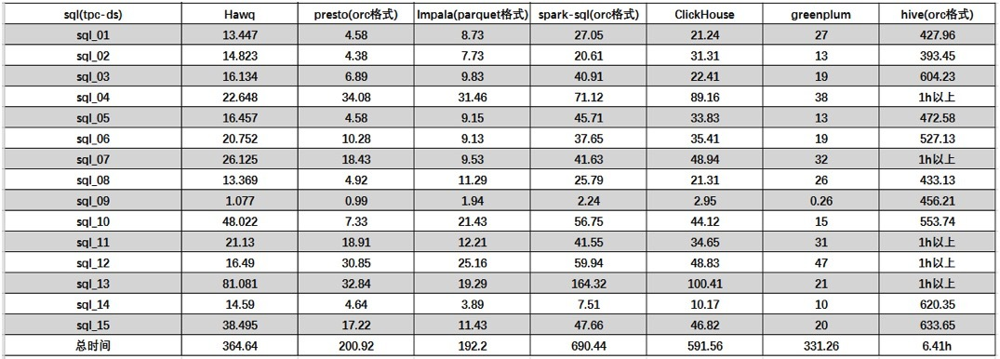
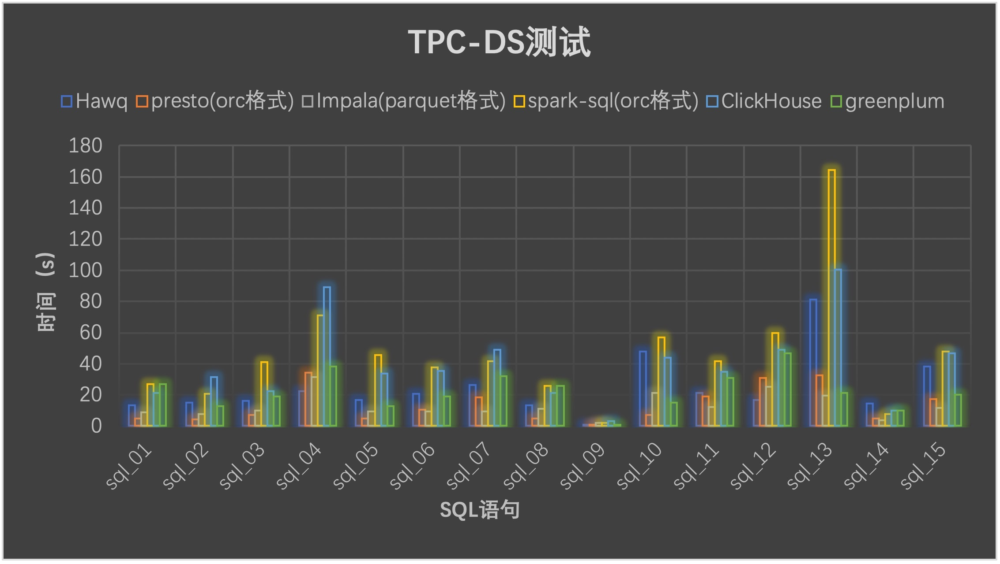
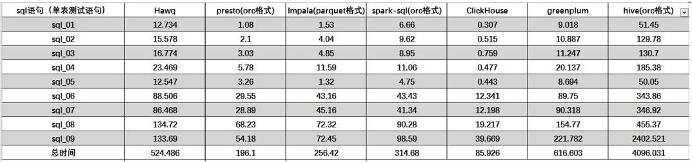
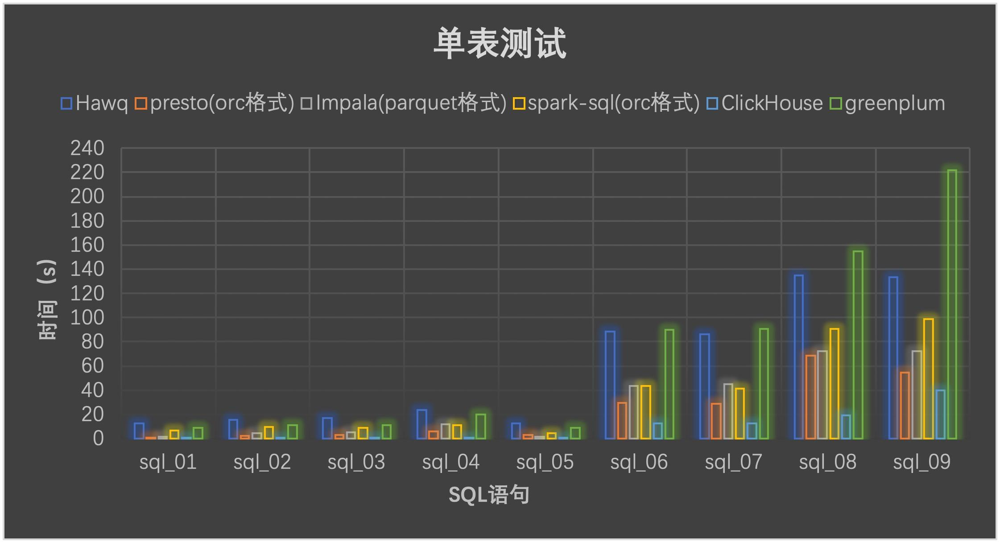

# 0 CH为什么查询速度快

首先，先确定CH速度是不是真的快。

此处参考文章[开源OLAP引擎哪个快？ (Presto、HAWQ、ClickHouse、GreenPlum) - 知乎 (zhihu.com)](https://zhuanlan.zhihu.com/p/54907288)

## 0.1 多表关联查询对比测试

通过选取的15条sql语句查询测试，从表中可以看出，presto、impala和hawq查询时间快于SparkSql和ClickHouse，性能约是SparkSql的2-3倍，其中尤其以Presto和Impala性能要好一些。greenplum在多表查询上也有不错的表现；ClickHouse对于多表join效果相比较于Presto、Impala、HAWQ不是很好，并且很多复杂语法支持的不够好，可见并不是为关联分析而设置；而hive无疑是所有组件中耗时最多的，其中部分语句查询时间超出1h的总时间按1h计算。

## 0.2 单表查询对比测试

从结果中我们发现，对于单表测试ClickHouse要比其余几种组件查询速度表现突出，测试性能约是其余四种的3-6倍。而Presto相比于HAWQ、Impala、SparkSql、GreenPlum在单表操作方面性能也稍好些。

从图像上更加清楚地显示出五种组件在单表测试方面性能的差距，Clickhouse在性能方面体现出了足够的优势，在单大表查询方面比其余组件性能都要好；Impala和Presto相比较，在sql_01-sql_05这5条语句是简单的一些求和求平均的单表操作方面，Presto的性能要比Impala好很多，而sql_06-sql_09一些复杂点的多个列的单表操作，Impala的性能要比Presto好一些，这也反映出Presto更加适合一些简单的数据量大的聚合操作，而Impala适合一些复杂的聚合操作。

最后我们发现HAWQ、GreenPlum在单表聚合操作方面性能不如其余四种组件，测试时间要大大超过它们，当然也不排除测试环境的影响，但是测试结果表明，HAWQ、GreenPlum不适合单表的复杂聚合操作，更适合多表的聚合操作。

# 1 存储

在很多情况下，I/O所占用的时间可以达到整个时间的90%以上。CH利用存储引擎的特殊设计充分减少磁盘I/O对查询速度的影响。

## 1.1 预排序

数据在写入时有序，不仅可以控制数据读取范围，还可以将**随机读**转化为**顺序读**。

## 1.2 列存储

在查询时只需要读取要查询的列。

## 1.3 压缩

由于每列数据的格式相同，因此数据能得到更大的压缩比。~~且由于CH的最小处理单元是块，一般由8192行数据组成，CH每次压缩解压缩只针对一个块内的数据，降低了CPU的压缩和解压缩时间。~~

# 2 计算引擎

ClickHouse计算引擎快的本质是利用了CPU提供的硬件加速特性。

## 2.1 向量化计算引擎

所谓向量化执行引擎其实就是利用了CPU的SIMD指令来处理计算。

- SIMD：Single Instruction Multiple Data，即单条指令操作多条数据。

# 3 如何保证ClickHouse的查询速度

根据最初的测试结果可知，ClickHous不是在所有场景下都能获得很强的性能。

ClickHouse计算引擎最精妙的设计在于向量化引擎，那么ClickHouse由于计算引擎原因导致的快，肯定是来自向量化引擎的加持。而ClickHouse的计算引擎导致的慢是因为缺乏代价优化器，那么由于计算引擎导致的慢也来自缺乏代价优化器带来的缺陷。基于这两个逻辑，我们可以分析出ClickHouse速度快的前提。

## 3.1 使用MergeTree存储引擎

按照业务需求，正确设置数据表的排序键，查询时需满足最左原则。

> 联合索引最左匹配原则：
>
> 确定是否使用一个联合索引时，会从索引定义的最左侧的字段逐一查看其是否存在于查询条件中。
> 因此，当索引为a_b_c_d时，查询条件包含a，b，则会使用此索引，并依次以a，b选取数据范围。当查询条件只含b，c时，不会使用此索引。当查询条件只含a，c时，会使用此索引，但只会根据a选取数据范围。
> 因此，在设计排序键时，应尽量按照字段在查询条件中出现的频率进行设计。

## 3.2 大量使用向量化运算

ClickHouse提供了很多**内置函数**，在使用这些内置函数时，ClickHouse会自动进行向量化优化。因此尽可能使用提供的内置函数进行计算，而不是自己写SQL语句。

## 3.3 查询语句中不使用Join子句，或尽可能少的使用Join操作

ClickHouse没有**代价优化器（CBO）**，这导致了ClickHouse在Join操作时会出现内存不足等情况，导致查询失败。Join的性能问题其实并不仅仅是ClickHouse才遇到，任何数据库在遇到大表Join时都有可能导致查询时间暴增。

大数据中的Spark计算引擎对Join操作做了非常多的优化，借助其强大的CBO实现了Join算法的自动选择。更是在此基础上，通过AQE（Adaptive Query Execution,自适应查询引擎），解决了大表Join操作时遇到数据倾斜时的性能问题。

正是由于ClickHouse没有实现CBO，因此ClickHouse在实现Join操作时，选择余地很少。尤其是分布式大表Join操作时，ClickHouse只实现了广播连接（Broadcast Join）算法，极大地降低了ClickHouse的Join能力。