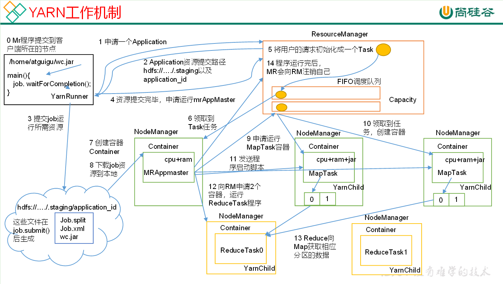

**Spark程序提交Yarn**

0. 程序提交到客户端所在节点 Driver
1. Driver 向 ResourceMananger（RM） 申请 Application
2. RM 向 Driver 返回 App资源提交路径 和 AppId
3. Driver 将Job运行所需资源提交到HDFS
4. Driver 向 RM 申请运行 AppMaster（AM）
5. RM 将用户请求初始化为一个Task，并将其放置在 Yarn的任务提交队列（队列） 中
6. NodeManager（NM） 在 队列 中领取到 Task
7. NM 创建 Container
8. Container 中运行 AM，AM 将Job所需资源下载到本地
9. AM 向 RM 申请运行 Executor 容器（请求放置在 队列 中）
10. NM 在 队列 中领取到运行 Executor 的任务，创建 Container
11. AM 向 Container 发送程序启动脚本
12. 重复申请、执行任务的过程，直到所有任务运行结束

